# Architecture & Internal Design

`qv` is built as an offline-first, modular diagnostic engine designed to analyze Python project ecosystems in sub-second execution time.

---

## 1. System Overview

Traditional linters inspect only individual source files (AST), while package managers typically only inspect lockfiles. `qv` bridges this gap by unifying four distinct layers of the Python ecosystem into an immutable diagnostic model:

1. **Manifests**: `pyproject.toml`, `requirements.txt`, `setup.cfg`, `Pipfile`.
2. **Active Environment**: `sys.executable`, `site-packages`, `importlib.metadata` distributions, and installed version constraints.
3. **Source Code AST**: Module import references, circular call loops, and orphan files.
4. **Runtime & Infrastructure**: `Dockerfile`, `docker-compose.yml`, and `.github/workflows/` CI matrices.

```text
                             CLI / TUI (click + rich)
                                        │
                                Project Discovery
                                        │
                            ProjectContext (Immutable)
                                        │
         ┌───────────────┬──────────────┴───────────────┬────────────────┐
   Dependencies    Environment                      Imports          Packaging
     Analyzer        Analyzer                       Analyzer          Analyzer
         └───────────────┼──────────────────────────────┴────────────────┘
                                        │
                                 AnalysisEngine
                                        │
                                Diagnostic Model
                                        │
                              Root Cause Correlator
                                        │
    ┌──────────────┬─────────────┼─────────────┬──────────────┬──────────────┐
 Terminal         JSON         SARIF         HTML         GitHub Actions   Interactive
 Reporter       Reporter     Reporter      Reporter         Annotator      TUI Dashboard
```

---

## 2. End-to-End Diagnostic Pipeline

The diagram below illustrates the complete lifecycle from project path discovery through multi-channel report generation:

```mermaid
flowchart TD
    subgraph Discovery["1. Discovery & Context Ingestion"]
        A["<b>File System Scanner</b><br/>Walks project root, excludes ignored paths"]
        B["<b>Manifest Parser</b><br/>Parses PEP 621, Poetry, Flit, setuptools, requirements"]
        C["<b>Environment Inspector</b><br/>Inspects active virtualenv & installed distributions"]
        D["<b>AST Module Parser</b><br/>Extracts import statements & relative import trees"]
        E["<b>Infrastructure Parser</b><br/>Extracts Docker base images & CI matrix versions"]
    end

    subgraph Context["2. Immutable Context"]
        CTX["<b>ProjectContext</b><br/>Frozen snapshot of project metadata, AST, and environment"]
    end

    subgraph Analyzers["3. Subsystem Analyzers"]
        F1["<b>Dependencies Analyzer</b><br/>Conflict resolution, undeclared/unused packages"]
        F2["<b>Environment Analyzer</b><br/>Python interpreter, Docker, and CI drift"]
        F3["<b>Imports Analyzer</b><br/>Tarjan's cycle algorithm & unresolvable modules"]
        F4["<b>Packaging Analyzer</b><br/>PEP 621 compliance & schema validation"]
    end

    subgraph Correlation["4. Correlation & Scoring"]
        G["<b>Analysis Engine & Correlator</b><br/>Aggregates findings, deduplicates evidence"]
        H["<b>Health Score Calculator</b><br/>Applies severity penalties (0–100 score)"]
    end

    subgraph Reporters["5. Reporting & Remediation"]
        R1["<b>Terminal Reporter</b><br/>Colorized Rich tables & boxes"]
        R2["<b>Interactive TUI</b><br/>Live dashboard with keyboard navigation"]
        R3["<b>Self-Contained HTML</b><br/>Single-file interactive report with SVG gauges"]
        R4["<b>SARIF v2.1.0 & JSON</b><br/>GitHub Security & CI integration"]
        R5["<b>Remediation Engine</b><br/>Safe diff generator & sync coordinator"]
    end

    Discovery --> CTX
    CTX --> Analyzers
    Analyzers --> Correlation
    Correlation --> Reporters
```



---

## 3. Subsystem Analyzers

All diagnostic checks are implemented as independent analyzers under `src/qv/analyzers/`. Each analyzer accepts the immutable `ProjectContext` and yields structured `Diagnostic` instances.

### 3.1 Dependencies Analyzer (`src/qv/analyzers/dependencies/`)
- **Constraint Conflict Engine**: Validates installed package versions against declared PEP 508 version specifiers.
- **Missing Dependency Detection**: Identifies third-party packages imported in source code that are missing from `pyproject.toml` or requirements files.
- **Unused Dependency Detection**: Pinpoints direct declared dependencies that are never referenced across project source files.
- **Standard Library Awareness**: Includes exhaustive Python 3.10–3.13 stdlib catalogs (accounting for PEP 594 removals).

### 3.2 Environment & Drift Analyzer (`src/qv/analyzers/environment/`)
- **Python Version Drift**: Compares the active virtualenv interpreter version against `requires-python` or target runtime.
- **Container Drift**: Scans `Dockerfile` and `compose.yml` for base image Python version tags that diverge from project targets.
- **CI Matrix Drift**: Verifies that GitHub Actions matrix definitions cover the Python versions declared in project manifests.

### 3.3 Imports & AST Analyzer (`src/qv/analyzers/imports/`)
- **Circular Import Cycle Detection**: Constructs a directed module dependency graph and uses **Tarjan's Strongly Connected Components (SCC)** algorithm to identify recursive import loops.
- **Unresolved Local Imports**: Flags imports that reference non-existent local packages or missing `__init__.py` files.
- **Orphan / Dead File Detection**: Identifies Python modules that are never imported by any other module, test file, or console script entry point.

### 3.4 Packaging Analyzer (`src/qv/analyzers/packaging/`)
- **PEP 621 Schema Validation**: Ensures required tables (`[project]`, `name`, `version`) are present and syntactically valid.
- **Build Backend Consistency**: Verifies configuration compatibility with standard build tools (`setuptools`, `flit_core`, `hatchling`, `poetry.core`, `pdm.backend`).

---

## 4. Immutable Core Models

All state within `qv` flows through immutable, strictly typed dataclasses defined in `src/qv/core/`:

### 4.1 `ProjectContext`
A frozen snapshot of discovered project assets:
- `root_dir`: Absolute project path.
- `manifest`: Parsed `pyproject.toml` or requirements metadata.
- `environment`: Active Python interpreter version, virtualenv path, and installed distributions.
- `source_files`: Parsed AST trees and imported module sets.
- `config`: User configuration loaded from `[tool.qv]`.

### 4.2 `Diagnostic`
A structured diagnostic finding:
- `rule_id`: Stable identifier (e.g. `DEP-001`, `IMP-001`).
- `title`: Short human-readable summary.
- `severity`: `ERROR`, `WARNING`, `INFO`.
- `message`: Specific description of the root cause.
- `location`: Optional file path and line number.
- `evidence`: Bulleted list of facts discovered during analysis.
- `suggestions`: Recommended CLI commands or code modifications.
- `fix_action`: Optional automated remediation plan.

---

## 5. Root Cause Engine & Health Scoring

`qv` scores project health on a scale from **0 to 100**:

$$\text{Health Score} = \max\left(0, 100 - \sum \text{Severity Penalties}\right)$$

### 5.1 Severity Penalties

| Finding Severity | Base Penalty | Behavior in Strict / CI Mode |
|---|---|---|
| **`ERROR`** | **-15 points** | Fails scan immediately (exit code 1). |
| **`WARNING`** | **-5 points** | Fails scan if `--strict` or `--ci` is enabled. |
| **`INFO`** | **-1 point** | Non-blocking advisory finding. |

### 5.2 Score Color Thresholds
- **Green (Healthy)**: $80 \le \text{Score} \le 100$
- **Yellow (Degraded)**: $50 \le \text{Score} \le 79$
- **Red (Critical)**: $0 \le \text{Score} \le 49$

---

## 6. Safe Automated Remediation Engine

The remediation engine (`src/qv/remediation/`) adheres to strict safety guarantees:

1. **Non-Destructive AST/TOML Editing**: Modifications to `pyproject.toml` preserve existing formatting, comments, and unrelated tables.
2. **Dry-Run Diff Generation**: All proposed fixes can be inspected in advance via `qv fix --dry-run`.
3. **Reversible Fix Actions**: Fixes are scoped to specific files with atomic writes.
4. **Package Manager Auto-Sync**: When `--sync` is passed, `qv` automatically invokes the project's native tool (`uv sync`, `poetry install`, `pip install`) to update the virtualenv.

---

## 7. Multi-Channel Reporting Pipeline

Diagnostics can be formatted and routed to multiple consumers:

- **Terminal Reporter**: Human-readable colorized output with evidence boxes and suggestion snippets.
- **Interactive TUI Dashboard (`qv inspect`)**: Rich terminal interface with dual panes, scrolling, keyboard shortcuts, and live dependency tree toggling.
- **Standalone HTML Report (`qv scan --html`)**: Single-file HTML dashboard with SVG health score meters, real-time client-side search, severity filters, and light/dark theme toggle.
- **SARIF v2.1.0 Reporter**: Standard OASIS SARIF format for GitHub Advanced Security and Code Scanning alerts.
- **JSON Reporter**: Machine-readable output for custom scripts and dashboard ingestion.

---

## 8. Codebase Directory Map

```text
src/qv/
├── __init__.py                # Package version and public exports
├── cli.py                     # Click CLI entry point and subcommands
├── core/
│   ├── config.py              # [tool.qv] configuration loader
│   ├── context.py             # ProjectContext discovery & data ingestion
│   ├── models.py              # Diagnostic, Severity, ScanResult dataclasses
│   └── rules.py               # RuleCatalog registry
├── analyzers/
│   ├── dependencies/          # DEP-001 through DEP-006 analyzers
│   ├── environment/           # ENV-001 through ENV-003 analyzers
│   ├── imports/               # IMP-001 through IMP-004 analyzers
│   └── packaging/             # PKG-001 and PKG-002 analyzers
├── remediation/
│   ├── engine.py              # Remediation planner and fix executor
│   └── actions.py             # Atomic manifest & TOML fix handlers
├── reporters/
│   ├── terminal.py            # Rich console output formatting
│   ├── html.py                # Standalone HTML report generator
│   ├── sarif.py               # SARIF v2.1.0 generator
│   ├── json.py                # JSON exporter
│   └── github.py              # GitHub Actions PR annotation emitter
├── tui/
│   └── dashboard.py           # Interactive Rich terminal explorer
└── visualizers/
    └── tree.py                # Dependency & circular import visualizer
```
