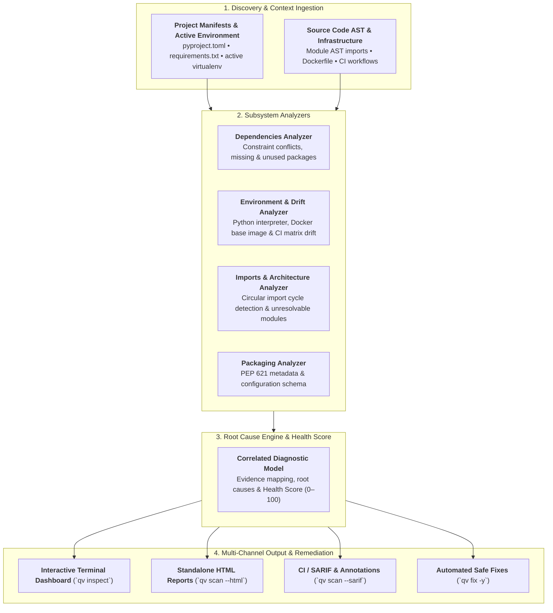

# qv Documentation

<div align="center" markdown>

**Diagnose why your Python project is unhealthy — understand the root cause and get safe, actionable fixes.**

[](https://pypi.org/project/python-qv/)
[](https://pypi.org/project/python-qv/)
[](https://opensource.org/licenses/MIT)

</div>

`qv` is a high-performance, offline-first health analyzer for Python projects. It inspects your project manifests, active virtual environment, source module AST, and packaging metadata in milliseconds to uncover broken dependencies, undeclared packages, circular import loops, and runtime drift across Docker and CI.

---

## 1. Overview & Architecture

Unlike generic tools that only inspect a single lockfile or flat requirements list, `qv` correlates multi-layer diagnostic signals across your entire project ecosystem:



👉 *Learn more in the comprehensive [Architecture & Internal Design](architecture.md) documentation.*

---

## 2. Install & Usage

Run `qv doctor` or `qv scan` directly in any Python project root:

=== "Using uv"
    ```bash
    uv add python-qv --dev
    uv run qv doctor
    ```

=== "Using pip"
    ```bash
    pip install python-qv
    qv doctor
    ```

=== "From GitHub (Latest)"
    ```bash
    pip install git+https://github.com/inzamol/qv.git
    qv doctor
    ```

=== "From Local Codebase"
    ```bash
    git clone https://github.com/inzamol/qv.git
    cd qv
    pip install -e .
    # or with uv
    uv pip install -e .
    ```

=== "Run without installing (uvx)"
    ```bash
    uvx python-qv doctor
    ```

=== "Run without installing (pipx)"
    ```bash
    pipx run python-qv doctor
    ```

### 2.1 Live Diagnostic Output

```text
🔍 qv
Project: payment-service
Python:  3.12.7
Package Manager: uv

🔴 1 Errors   🟡 1 Warnings   🟢 48 Checks Passed

┌────────────────── 🔴 DEP-001 Dependency constraint conflict ─────────────────┐
│ celery 5.4.0 requires kombu<5.4.0,>=5.3.0, but installed is kombu 5.5.2.     │
│                                                                              │
│ Evidence:                                                                    │
│   • celery declared requirement: kombu<5.4.0,>=5.3.0                         │
│   • Installed kombu version: 5.5.2 in active environment                     │
│                                                                              │
│ Suggested fix:                                                               │
│   Upgrade celery or pin kombu to <5.4.0,>=5.3.0.                             │
│   $ uv add 'kombu<5.4.0,>=5.3.0'                                             │
└──────────────────────────────────────────────────────────────────────────────┘

Health Score: 85/100
```

---

## 3. Core Feature Pillars

<div class="grid cards" markdown>

-   __Interactive Terminal Dashboard__

    ---

    Explore findings interactively with keyboard navigation (`↑`/`↓`), expand evidence, view live dependency trees (`t`), and apply fixes (`f`) in a rich TUI.

    [:material-arrow-right: Open TUI Guide](tui.md)

-   __Self-Contained HTML Reports__

    ---

    Generate portable, zero-dependency HTML reports (`qv scan --html`) with circular health score gauges, real-time search, severity filters, and dark mode.

    [:material-arrow-right: Open HTML Report Guide](html_report.md)

-   __Safe Automated Fixes__

    ---

    Compute deterministic remediation plans with `qv fix --dry-run` and safely synchronize manifests and package managers with `qv fix --sync -y`.

    [:material-arrow-right: Open Remediation Guide](remediation.md)

-   __Dependency & Import Trees__

    ---

    Visualize direct vs transitive package trees (`qv tree -d`) and internal module import architecture with circular loops highlighted (`qv tree -i`).

    [:material-arrow-right: Open Tree Visualizer Guide](tree.md)

</div>

---

## 4. Diagnostic Subsystems

| Subsystem | Scope & Capabilities | Key Rules |
|---|---|---|
| **Dependencies** | Constraint conflicts, undeclared imports, unused packages, Python compatibility mismatches | `DEP-001` through `DEP-006` |
| **Environment** | Interpreter version drift, Dockerfile base image mismatches, CI matrix synchronization | `ENV-001` through `ENV-003` |
| **Architecture** | Circular import cycle detection, unresolvable module imports, dead orphan files, deprecated stdlib | `IMP-001` through `IMP-004` |
| **Packaging** | PEP 621 metadata validation, TOML syntax verification, entrypoint checks | `PKG-001`, `PKG-002` |
| **Docker** | Security best practices, root user risks, unpinned base images, sensitive file leaks | `DOC-001` through `DOC-014` |
| **CI Workflows** | Matrix mismatches, unpinned dependencies, outdated GitHub Actions, quality gates, hardcoded secrets | `CI-001` through `CI-006` |
| **Frameworks** | FastAPI (`FAP-xxx`), SQLAlchemy (`SQL-xxx`), Django (`DJG-xxx`), Celery (`CEL-xxx`) | `FAP`, `SQL`, `DJG`, `CEL` |

👉 *Browse full rule descriptions and remediation strategies in the [Rules Catalog](rules.md).*

---

## 5. Feature Comparison

| Capability | `qv` | `pip check` | `deptry` | `pip-audit` |
|---|:---:|:---:|:---:|:---:|
| **Dependency Constraint Conflicts** | :white_check_mark: | :white_check_mark: | :x: | :x: |
| **Undeclared & Unused Dependencies** | :white_check_mark: | :x: | :white_check_mark: | :x: |
| **Circular Import Cycle Detection** | :white_check_mark: | :x: | :x: | :x: |
| **Python & Docker/CI Runtime Drift** | :white_check_mark: | :x: | :x: | :x: |
| **Interactive Terminal Explorer (TUI)** | :white_check_mark: | :x: | :x: | :x: |
| **Standalone Interactive HTML Reports** | :white_check_mark: | :x: | :x: | :x: |
| **Automated Safe Remediation (`qv fix`)** | :white_check_mark: | :x: | :x: | :x: |
| **SARIF v2.1.0 & GitHub PR Annotations** | :white_check_mark: | :x: | :x: | :x: |
| **Sub-Second Offline Execution** | :white_check_mark: | :white_check_mark: | :white_check_mark: | :x: (requires network) |

---

## 6. Explore Documentation

<div class="grid cards" markdown>

-   __Architecture & Design__

    ---

    Deep dive into discovery pipelines, immutable models, and analyzer subsystems.

    [:material-arrow-right: Explore Architecture](architecture.md)

-   __Getting Started Guide__

    ---

    Step-by-step setup, first health scan, and baseline configuration.

    [:material-arrow-right: Read Getting Started](getting_started.md)

-   __CLI Commands Reference__

    ---

    Complete flag reference, exit codes, and output formatting options.

    [:material-arrow-right: Explore CLI Reference](cli_reference.md)

-   __Diagnostic Rules Catalog__

    ---

    Exhaustive documentation for every diagnostic rule and remediation plan.

    [:material-arrow-right: View Rules Catalog](rules.md)

-   __Configuration Guide__

    ---

    Configure severities, ignore rules, and exclude path patterns in `pyproject.toml`.

    [:material-arrow-right: View Configuration](configuration.md)

-   __CI/CD & GitHub Actions__

    ---

    Integrate with GitHub Actions, SARIF code scanning alerts, and workflows.

    [:material-arrow-right: View CI Integration](ci_integration.md)

-   __Pre-commit Integration__

    ---

    Enforce clean health scans before commits reach your remote repository.

    [:material-arrow-right: View Pre-commit Guide](pre_commit.md)

-   __Contributing Guide__

    ---

    Development environment setup, Tox testing matrix, and authoring new rules.

    [:material-arrow-right: Read Contributing](contributing.md)

</div>
